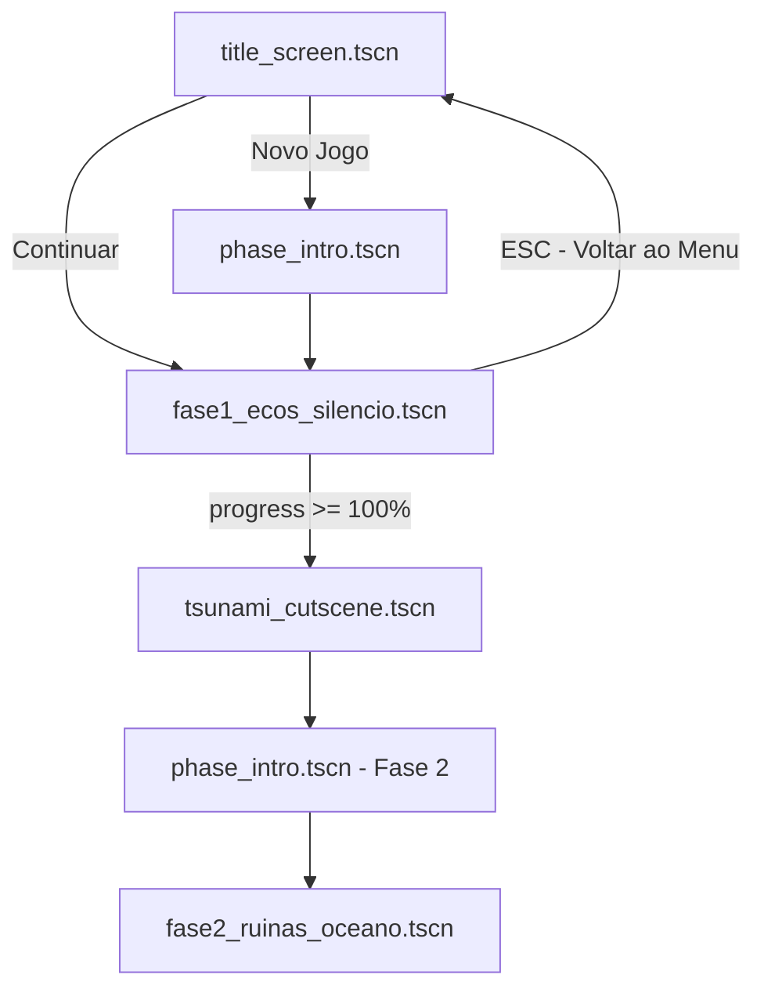
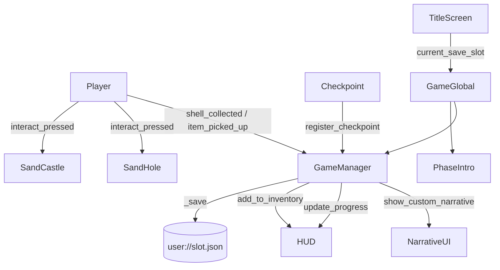
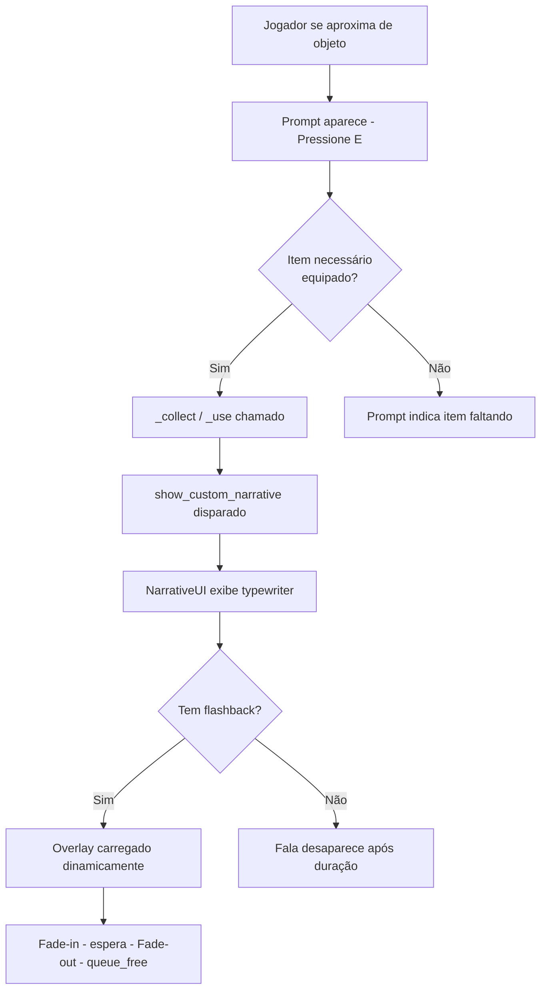
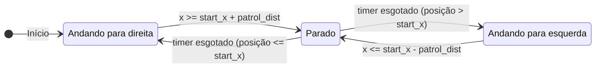
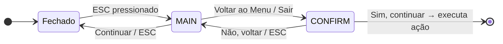

# Ichigo: Memórias do Oceano (Godot)

Um jogo 2D de plataforma narrativo desenvolvido em **Godot 4.5 / GDScript**, com motor narrativo baseado em **Máquinas de Estados Finitos (FSM)** e estruturas de dados.

Ichigo é uma criança sobrevivente de um tsunami. O jogo acompanha sua jornada pela praia logo após o desastre, coletando memórias, objetos e fragmentos de um passado que a água tentou apagar.

---

## Motivação do Projeto

Jogos com narrativas emocionais geralmente progridem de forma linear e estática. Este projeto propõe uma abordagem diferente:

* **O ambiente responde ao estado emocional da narrativa**: clima e obstáculos mudam dinamicamente conforme o jogador avança, controlados por uma FSM.
* **A história é contada pelo mundo**, não por telas de texto: objetos encontrados, NPCs que reagem à presença do jogador e flashbacks ativados por interações constroem a narrativa de forma orgânica.
* **Estruturas de dados com propósito**: o dicionário de narrativas, as zonas de spawn e o inventário com slots são escolhas técnicas deliberadas que constroem a experiência do jogo.

---

## Documento de Design do Jogo (GDD)

O GDD descreve mecânicas, narrativa, design de fases, arte, áudio e plano de testes.
Você pode acessá-lo aqui: [GDD.md](GDD.md)

Para a documentação técnica completa (padrões de projeto, módulos, save/load, DevOps):
[DOCUMENTACAO_TECNICA.md](DOCUMENTACAO_TECNICA.md)

---

## Dependências

### Software

* **Godot Engine 4.5** (versão LTS recomendada — mesma utilizada no desenvolvimento)
* **GDScript** (nativo da engine, sem instalação adicional)

### Testes

* **GUT (Godot Unit Testing)** — framework de testes unitários para GDScript, disponível via AssetLib
* Testes de comportamento de FSM, spawn determinístico e save/load

### Pacotes e Recursos

* Sprites pixel art originais criados no **Aseprite** (formato `.svg` / `.png`)
* Áudio via `AudioStreamPlayer` e `AudioStreamPlayer2D` nativos do Godot
* Sem dependências externas de plugins — a engine cobre todos os sistemas necessários

### Plataforma Alvo

* **Desktop** (Windows) — exportado via Godot Export Templates e hospedado no itch.io
* **Controles:** Teclado (setas ou WASD) + Mouse

---

## Modelagem Conceitual

Resumo das entidades principais e suas responsabilidades:

| Entidade | Tipo | Responsabilidade Principal | Script |
| :--- | :--- | :--- | :--- |
| **Ichigo (Player)** | `CharacterBody2D` | Física, movimentação, coleta de itens | [player.gd](scripts/player.gd) |
| **GameManager** | `Node` | FSM narrativa, clima, spawn aleatório, save/load | [game_manager.gd](scripts/game_manager.gd) |
| **GameGlobal** | Autoload (Singleton) | Dados persistentes entre cenas (fase, slot) | [game_global.gd](scripts/game_global.gd) |
| **HUD** | `Control` | Inventário (8 slots), barra de progresso | [hud.gd](scripts/hud.gd) |
| **NarrativeUI** | `Control` | Exibição de falas com efeito typewriter e fila | [narrative_ui.gd](scripts/narrative_ui.gd) |
| **TitleScreen** | `Control` | Menu principal, seleção de slot de save | [title_screen.gd](scripts/title_screen.gd) |
| **PauseMenu** | `CanvasLayer` | Menu de pausa com confirmação de saída | [pause_menu.gd](scripts/pause_menu.gd) |
| **MemoryObject** | `Node2D` | Objeto de memória genérico configurável por export | [memory_object.gd](scripts/memory_object.gd) |
| **Checkpoint** | `Area2D` | Registra ponto de salvamento e dispara save | [checkpoint.gd](scripts/checkpoint.gd) |
| **Collectible** | `Area2D` | Item coletável com bobbing e efeitos visuais | [collectible.gd](scripts/collectible.gd) |
| **Crab** | `CharacterBody2D` | NPC com FSM de patrulha (direita/esquerda/pausa) | [crab.gd](scripts/crab.gd) |
| **Seagull** | `Node2D` | NPC que detecta o jogador e voa para longe | [seagull.gd](scripts/seagull.gd) |
| **TsunamiCutscene** | `Node2D` | Cutscene pixel art renderizada inteiramente por código | [tsunami_cutscene.gd](scripts/tsunami_cutscene.gd) |

---

## Arquitetura

### Visão Geral

A arquitetura é organizada em quatro camadas com responsabilidades separadas:

1. **Apresentação**: HUD, menus, overlays, narrativa
2. **Domínio**: GameManager (FSM), Player, Checkpoint
3. **Mundo / Entidades**: NPCs, coletáveis, objetos de memória
4. **Infraestrutura**: GameGlobal (Autoload), arquivos JSON locais

### Fluxo de Cenas



### Diagrama de Componentes



---

## Componentes Principais

### Motor Narrativo — FSM (`GameManager`)

O ambiente inteiro reage ao estado atual da FSM, determinado pela posição X do jogador no mapa (0–6400 px):

```mermaid
stateDiagram-v2
    direction LR
    [*] --> INICIO: Início da fase

    INICIO: Praia quieta\nSol claro (0–15%)
    RECONHECIMENTO: Memórias surgem\nLeve nublado (15–40%)
    LEMBRANCA: Lembranças fortes\nCéu encoberto (40–65%)
    CONFRONTO: Pico emocional\nChuva leve (65–85%)
    RESOLUCAO: Caminhada final\nLuz dourada (85–100%)

    INICIO --> RECONHECIMENTO: progress >= 0.15
    RECONHECIMENTO --> LEMBRANCA: progress >= 0.40
    LEMBRANCA --> CONFRONTO: progress >= 0.65
    CONFRONTO --> RESOLUCAO: progress >= 0.85
    RESOLUCAO --> [*]: phase_complete
```



Cada transição dispara simultaneamente:
- Nova fala narrativa (via `NarrativeUI`)
- Ajuste de clima (cor de tint + partículas de chuva)
- Fade de detritos no cenário

### Fluxo de Diálogo Narrativo



### NPC — Sistema de Patrulha (`Crab`)



### Menu de Pausa — Estado com Confirmação



---

## Arquitetura Orientada a Conteúdo

Um dos pilares do projeto é a separação entre **lógica** e **conteúdo**, permitindo que novas memórias, objetos e narrativas sejam adicionados sem modificar código existente.

O script `memory_object.gd` é totalmente configurável via `@export` no Editor do Godot:

```gdscript
@export var item_type         := ""          # Item adicionado ao inventário
@export var narrative_text    := ""          # Fala exibida ao coletar
@export var has_flashback     := false       # Abre overlay de flashback
@export var flashback_caption := ""          # Texto do flashback
@export var use_photo_overlay := false       # Foto re-examinável
@export var overlay_texture:  Texture2D = null
@export var use_diary_overlay := false       # Abre página de diário
```

Com isso:
- **Qualquer objeto de memória** pode ser criado no Editor sem escrever código
- **Novas falas narrativas** são adicionadas ao dicionário `NARRATIVAS` em `game_manager.gd`
- **Novas fases** são inseridas com um novo valor no `match` de `phase_intro.gd`
- O **sistema de save** persiste automaticamente qualquer item adicionado via `item_type`

---

## Testes Automatizados

O projeto utiliza o **GUT (Godot Unit Testing)** para testes de unidade e integração em GDScript. Os arquivos de teste estão em `tests/` e cobrem os módulos principais do jogo.

### Arquivos de Teste

| Arquivo | O que testa | Nº de testes |
| :--- | :--- | :--- |
| [tests/test_procedural_sfx.gd](tests/test_procedural_sfx.gd) | Geração de áudio — retorno, loop, determinismo, formato | 20 |
| [tests/test_game_global.gd](tests/test_game_global.gd) | Singleton GameGlobal — valores padrão, atribuição, isolamento | 15 |
| [tests/test_fsm_logica.gd](tests/test_fsm_logica.gd) | FSM — limiares de estado, progresso, checkpoints, narrativas | 18 |
| [tests/test_inventario.gd](tests/test_inventario.gd) | HUD inventário — adicionar, empilhar, slot ativo, restore, round-trip | 17 |
| [tests/test_coletaveis.gd](tests/test_coletaveis.gd) | Collectible, MemoryObject, SandHole, Checkpoint — estado inicial e lógica | 15 |

### Como Rodar os Testes

1. No Godot Editor, abra **AssetLib**, pesquise **"GUT"** e instale
2. Ative em **Project → Project Settings → Plugins → GUT: Enable**
3. No painel GUT que aparece, clique em **Run All**

O arquivo `.gutconfig.json` na raiz do projeto aponta automaticamente para `tests/`.

---

## Registro de Decisões (ADR)

| Decisão | Alternativa Considerada | Motivo da Escolha |
| :--- | :--- | :--- |
| **Godot 4.5 / GDScript** | Unity / C# | Código aberto, leveza, curva de aprendizado menor e exportação nativa para Windows |
| **FSM própria com `enum`** | Plugin de state machine | Controle total, aprendizado técnico, sem dependências externas |
| **Save em JSON local** | PlayerPrefs / banco de dados | Transparência do formato, facilidade de debug, sem dependências de servidor |
| **Spawn com seed salva** | Posições fixas no mapa | Permite replay determinístico mantendo a surpresa a cada nova partida |
| **CanvasLayer para PauseMenu** | Cena filha com `process_mode` | Garante renderização acima de tudo (layer 30) e funcionamento independente do `paused` |
| **`_draw()` na cutscene** | Sprites externos | Cutscene de tsunami inteiramente procedural, sem assets externos |
| **Pixel art 320×180 (3×)** | Resolução nativa maior | Estética coerente com a proposta, performance garantida em qualquer hardware |

---

## Resultados

O jogo foi validado como entrega funcional da disciplina de PAC com todos os requisitos funcionais (RF01–RF07) e não-funcionais (RNF01–RNF05) implementados e verificados.

A Fase 1 — *Ecos do Silêncio* — está completa e jogável:
- Motor narrativo FSM com 5 estados ambientais
- Sistema de save/load com 3 slots independentes
- 6 tipos de objetos de memória interativos
- Cutscene de tsunami renderizada proceduralmente

---

## Como Adicionar Novo Conteúdo

### Adicionar um Novo Objeto de Memória

1. Na cena `fase1_ecos_silencio.tscn`, instancie um nó filho de `memory_object.tscn`
2. No Inspector, configure os campos `@export`:
   - `narrative_text`: fala exibida ao interagir
   - `item_type`: nome do item adicionado ao inventário (deve estar em `ITEM_TEXTURES` do HUD)
   - `has_flashback`: marque para abrir o overlay de flashback
   - `use_photo_overlay`: marque para abrir a foto (re-examinável)
3. Nenhuma alteração de código é necessária

### Adicionar um Novo Checkpoint

1. Instancie `checkpoint.tscn` na cena da fase
2. Defina `@export var checkpoint_id: int` com o próximo número sequencial
3. Adicione a posição X de spawn correspondente em `game_manager.gd`:
   ```gdscript
   const _CHECKPOINT_X := { 0: 80.0, 1: 700.0, 2: 2200.0, 3: 4500.0, 4: SUA_POSICAO }
   ```

### Adicionar uma Nova Fala Narrativa

Em `game_manager.gd`, adicione ao dicionário `NARRATIVAS`:

```gdscript
const NARRATIVAS := {
    # ... existentes ...
    "minha_chave": "Texto que aparece na tela.",
}
```

Dispare com: `gm.show_custom_narrative("Texto direto")` ou `_show_narrative("minha_chave")`.

---

## Instruções de Execução

### Baixar no itch.io

1. Acesse a página do jogo no **itch.io** e baixe o arquivo `.zip` para Windows
2. Extraia o `.zip` e execute `ichigo.exe`

### Executar localmente

1. Instale o [Godot Engine 4.5](https://godotengine.org/download)
2. Clone o repositório:
   ```bash
   git clone https://github.com/anacstralioti/portfolio-catolica.git
   cd portfolio-catolica
   ```
3. Abra o Godot → **File → Open Project** → selecione a pasta do projeto
4. Pressione **F5** ou clique em **Play** para executar

### Exportar para Windows

1. No Godot: **Project → Export → Windows Desktop**
2. Configure o caminho de saída e clique em **Export Project**
3. O executável `.exe` será gerado na pasta configurada

---

## Trabalhos Futuros

* Implementar as **Fases 2 e 3**

---

## Licenciamento

* **Código do jogo**: [Licença MIT](https://opensource.org/licenses/MIT)
* **Godot Engine**: [Licença MIT](https://opensource.org/licenses/MIT)
* **Arte e assets originais**: [Creative Commons BY-NC-SA 4.0](https://creativecommons.org/licenses/by-nc-sa/4.0/deed.pt_BR)
* **Áudio**: [Creative Commons BY-NC-SA 4.0](https://creativecommons.org/licenses/by-nc-sa/4.0/deed.pt_BR)

---